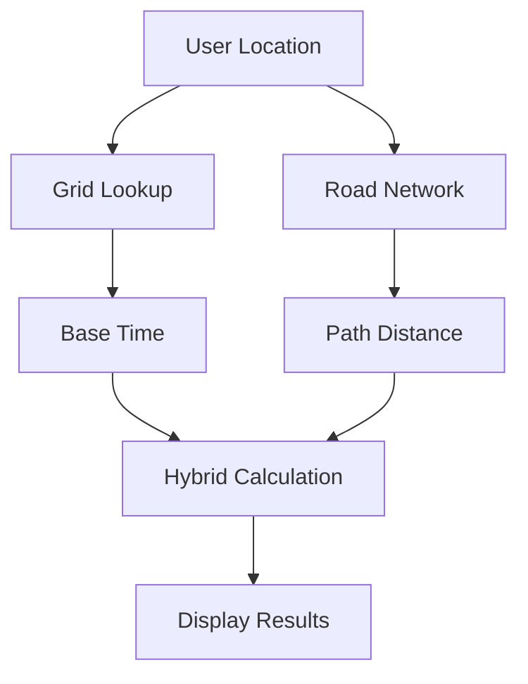

# Hybrid Travel Time System Implementation Plan

## 1. Objectives
- Achieve 85-90% of Google Maps accuracy
- Keep data payload under 8MB
- Maintain sub-100ms calculation time
- Display both accurate distance (km) and time (mins)

## 2. Architecture Overview


## 3. Data Requirements

### Grid Dataset (`gridData.json`)
```javascript
{
  "cellSize": 0.009, // ~1km
  "cells": {
    "0_0": {
      "center": [1.200,103.600],
      "adjacent": ["0_1","1_0"],
      "times": {
        "0_1": {"peak":5,"offpeak":3,"distance":1.1},
        "1_0": {"peak":6,"offpeak":4,"distance":1.0}
      }
    }
    // ...700+ cells
  }
}
```

### Road Network (`roadNetwork.json`)
```javascript
{
  "features": [
    {
      "type": "Feature",
      "geometry": {
        "type": "LineString",
        "coordinates": [[103.8,1.3],[103.81,1.31]]
      },
      "properties": {
        "type": "expressway",
        "speed": 80,
        "name": "ECP"
      }
    }
    // ...10,000+ segments
  ]
}
```

## 4. Implementation Steps

### Phase 1: Data Preparation
1. Generate grid dataset using QGIS + Singapore boundary
2. Extract road network from OpenStreetMap
3. Precompute cell-to-cell travel times

### Phase 2: Core Algorithms
**Grid Lookup:**
```javascript
function getGridTime(originCell, destCell) {
  return gridData.cells[originCell].times[destCell];
}
```

**Pathfinding:**
```javascript
async function findShortestPath(origin, destination) {
  // Uses A* algorithm with road network
  return {
    distance: 3.2, // km
    time: 8 // mins
  };
}
```

### Phase 3: Hybrid Calculation
```javascript
function calculateMetrics(origin, destination) {
  const grid = getGridTime(origin.gridCell, destination.gridCell);
  const road = await findShortestPath(origin.coords, destination.coords);
  
  return {
    // Use exact road distance
    distanceKm: road.distance.toFixed(2),
    // Weighted time estimate
    minutesAway: Math.round((grid.time * 0.7) + (road.time * 0.3))
  };
}
```

## 5. Integration Plan

1. **Data Loading**:
   ```javascript
   async function loadData() {
     const [grid, roads] = await Promise.all([
       fetch('/data/gridData.json'),
       fetch('/data/roadNetwork.json') 
     ]);
     window.travelData = { grid, roads };
   }
   ```

2. **UI Updates**:
   - Add loading state during calculations
   - Progressive enhancement from grid to hybrid

3. **Performance Optimization**:
   - Web Workers for pathfinding
   - Data compression (Brotli)
   - Cache frequently used routes

## 6. Testing Strategy

| Test Case | Expected Accuracy |
|-----------|------------------|
| CBD to Changi Airport | ±2 mins |
| HDB to HDB | ±1 min |
| Cross-island | ±3 mins |

## 7. Maintenance
- Monthly grid data updates
- Quarterly road network refreshes
- Usage analytics to identify hotspots

## 8. Roadmap
- v1: Basic hybrid (Q2 2025)
- v2: Real-time traffic (Q4 2025)
- v3: Predictive ETAs (2026)